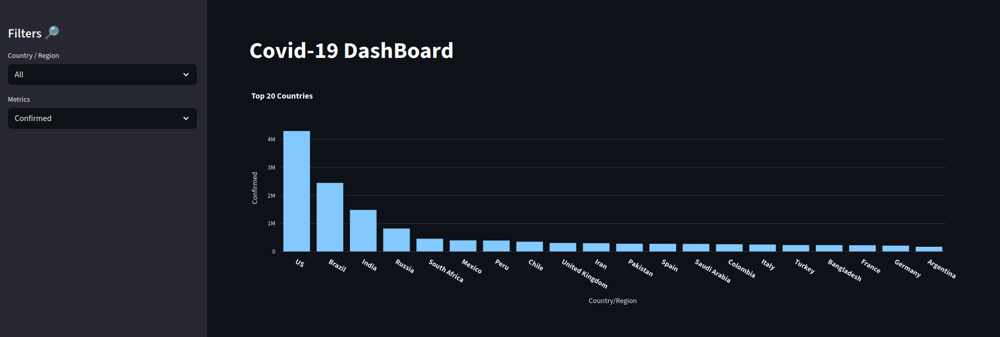
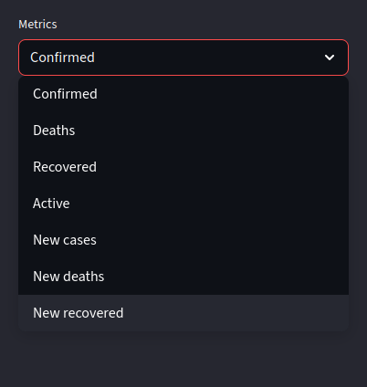

# Covid-19 Dashboard 🦠

An interactive dashboard for visualizing Covid-19 data, built with Streamlit, Pandas, and Plotly.

## 📜 About the Project

This project presents a web dashboard that allows users to explore global Covid-19 data. It is possible to filter the data by country and visualize different metrics, such as confirmed cases, deaths, and recovered, in a simple and intuitive way.

## ✨ Features

- **Interactive Visualization:** Dynamic bar chart that updates based on user selections.
- **Filter by Country/Region:** Allows selecting a specific country or viewing global data.
- **Metric Selection:** Choose from various metrics like "Confirmed", "Deaths", "Recovered", "Active Cases", etc.
- **Top 20 Ranking:** When "All" is selected, the chart displays the 20 countries with the highest numbers for the chosen metric.

## 🚀 Technologies Used

The project was developed using the following technologies:

- **Python:** The main programming language.
- **Streamlit:** A framework for rapidly creating data web applications.
- **Pandas:** A library for data manipulation and analysis from the CSV file.
- **Plotly Express:** A library for creating high-quality, interactive charts.

## 🖼️ Application Screenshots

### Overview (Top 20 Countries for a Metric)
The main screen displays the ranking of the top 20 countries for the selected metric.



### Filtered View by Country
When a country is selected, the chart focuses on the data for that specific region.


### Filtered View by Metric



## ⚙️ How to Run the Project

Follow the steps below to run the project on your local machine.

### Prerequisites

- Python 3.8 ou superior
- `pip` (Python package manager)

### Installation Steps

1. **Clone the repository** (if you are using git):
   ```bash
   git clone https://github.com/JoaoPedroHenriquesB/Covid19-DashBoard.git
   cd covid_dashboard
   ```

2. **Install the dependencies** from the `requirements.txt` file:
   ```bash
   pip install -r requirements.txt
   ```

3. **Run the Streamlit application:**
   ```bash
   streamlit run src/covid_dashboard.py
   ```

After running the last command, the dashboard will automatically open in your default browser.
